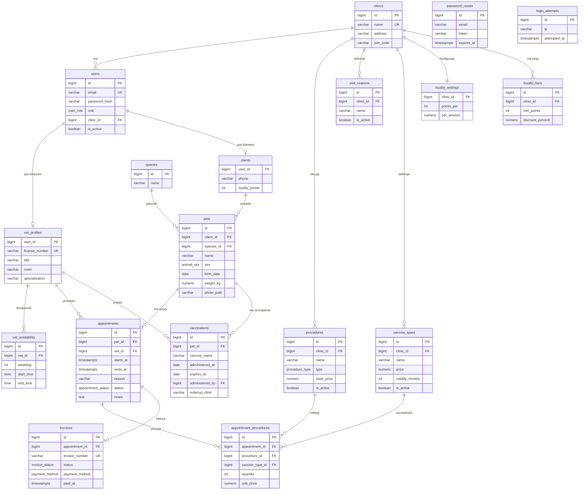
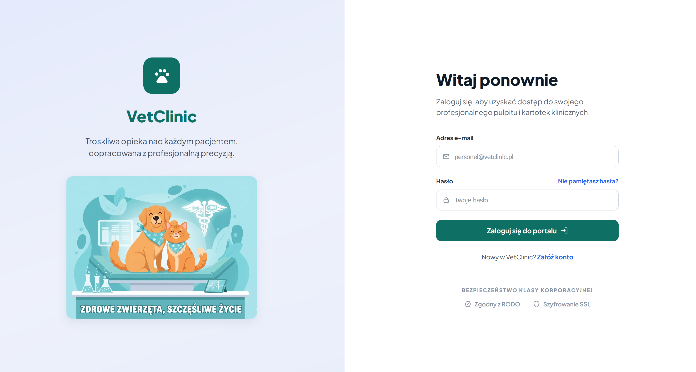
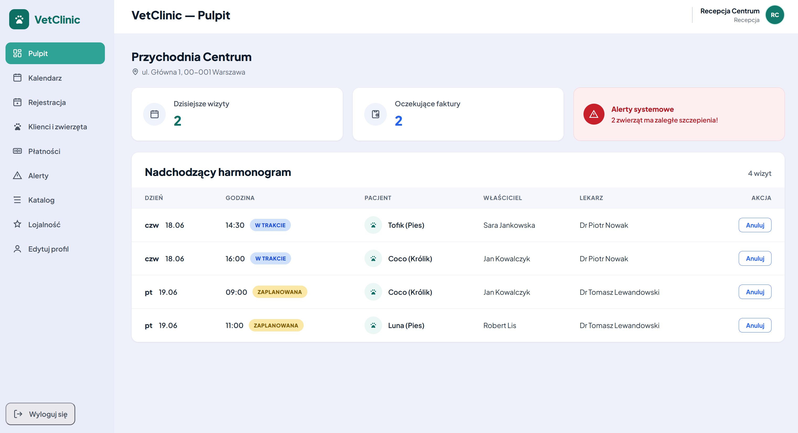
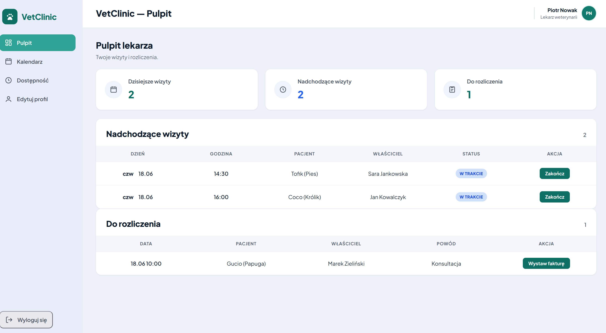
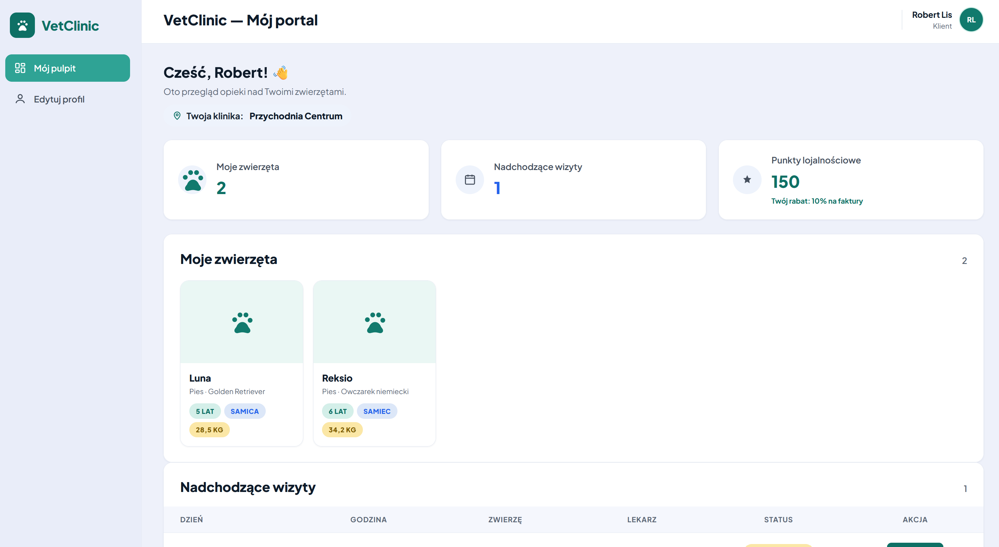
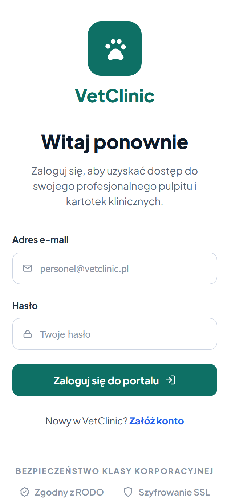
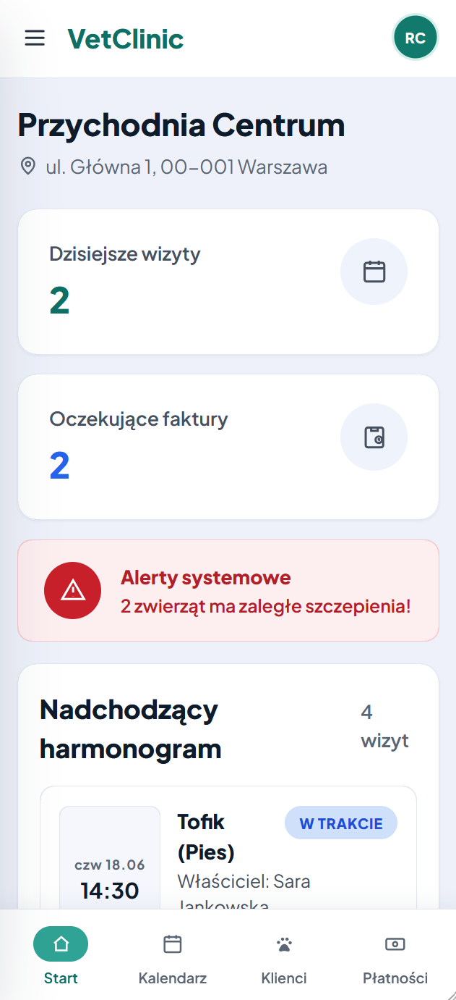
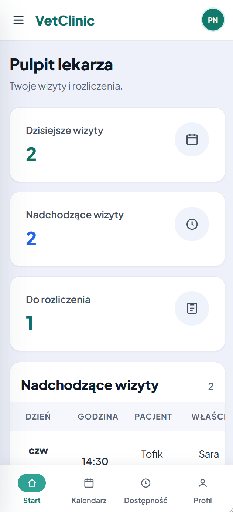
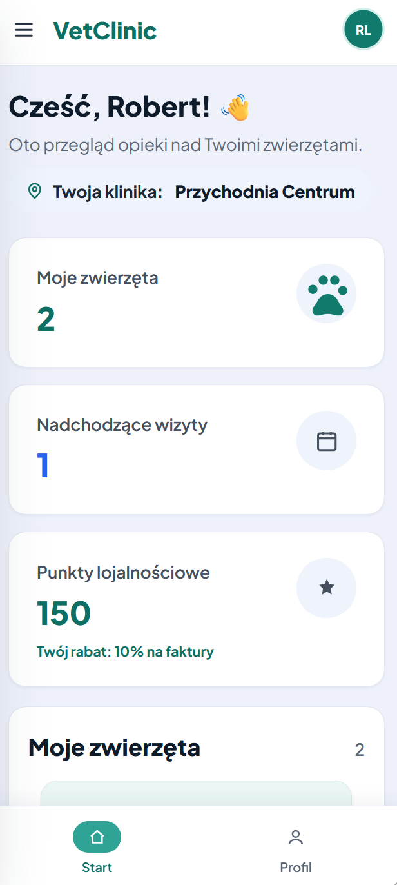

# VetClinic — System Obsługi Gabinetu Weterynaryjnego

Aplikacja webowa do zarządzania przychodnią weterynaryjną, zbudowana na własnym mini‑frameworku PHP (bez Laravela/Symfony) w architekturze MVC. Projekt z przedmiotu **Wstęp do Projektowania Aplikacji Internetowych (WDPAI)**.

System jest **wieloklinikowy (multi‑tenant)** — każda przychodnia ma odizolowane dane, własny katalog usług, cennik i program lojalnościowy.

---

## Spis treści

- [Funkcjonalności](#funkcjonalności)
- [Stack technologiczny](#stack-technologiczny)
- [Architektura](#architektura)
- [Uruchomienie](#uruchomienie)
- [Konta testowe](#konta-testowe)
- [Przepływy aplikacji](#przepływy-aplikacji)
- [Baza danych](#baza-danych)
- [Diagram ERD](#diagram-erd)
- [Bezpieczeństwo](#bezpieczeństwo)
- [Obsługa błędów](#obsługa-błędów)
- [Testy](#testy)
- [Struktura katalogów](#struktura-katalogów)
- [Zrzuty ekranu](#zrzuty-ekranu)

---

## Funkcjonalności

### Klient (właściciel zwierzęcia)
- Portal z przeglądem zwierząt, nadchodzących wizyt, faktur i punktów lojalnościowych.
- Karta zwierzęcia (tylko do odczytu): dane, szczepienia, historia wizyt.
- **Potwierdzanie zaplanowanej wizyty.**
- Aktualny **rabat lojalnościowy** przeliczany na podstawie progów kliniki.
- Edycja profilu i zmiana hasła.

### Lekarz (weterynarz)
- Pulpit: dzisiejsze/nadchodzące wizyty, wizyty do rozliczenia.
- Kalendarz tygodniowy **tylko z własnymi wizytami** (pozycjonowanie minutowe).
- Ustawianie **cyklicznej dostępności** tygodniowej.
- **Zakończenie wizyty** (możliwe 15 min po starcie, z opcjonalną notatką w popupie).
- **Wystawianie faktury** z katalogu zabiegów kliniki; opcjonalne oznaczenie podanej szczepionki (aktualizuje kartę szczepień pacjenta).
- Edycja profilu zawodowego (tytuł, gabinet, specjalizacja, numer licencji).

### Recepcja (administrator kliniki)
- Pulpit: dzisiejsze wizyty, oczekujące faktury, baner alertów, nazwa i adres kliniki.
- Kalendarz całej kliniki.
- **Rejestracja wizyty** w osobnym widoku z podglądem **dostępności i zajętych terminów** wybranego lekarza.
- Klienci i zwierzęta + **tabela lekarzy**, z usuwaniem (soft‑delete) klientów i lekarzy.
- **Alerty** — zaległe szczepienia w klinice.
- **Katalog** — powody wizyt, szczepionki (cena, ważność), zabiegi (cena).
- **Program lojalnościowy** — zasady naliczania punktów i progi zniżek.
- Płatności (rejestracja zapłaty → naliczenie punktów).
- Edycja danych kliniki (nazwa, adres, hasło dołączeniowe).

### Wspólne
- Rejestracja konta z wyborem roli; recepcja zakłada klinikę (nazwa, adres, hasło dołączeniowe), lekarz/klient dołącza podając kod kliniki.
- Logowanie z **limitem prób** i bezpieczną sesją.
- Reset hasła przez e‑mail (neutralne komunikaty, bez ujawniania istnienia konta).

---

## Stack technologiczny

| Warstwa | Technologia |
|---|---|
| Backend | PHP 8.3 (OOP, bez frameworka — własny mini‑framework) |
| Baza danych | PostgreSQL 16 |
| Frontend | HTML5, CSS, JavaScript (Fetch API / AJAX) |
| Serwer WWW | Nginx + PHP‑FPM |
| Konteneryzacja | Docker + Docker Compose |
| Poczta (dev) | Mailpit (catcher SMTP) |
| Administracja DB | pgAdmin 4 |

---

## Architektura

Wzorzec **MVC** z dodatkowymi warstwami (Service, Repository):

```
Request → Router → Middleware (Auth/Role) → Controller → Service → Repository → Model
                                                  ↓
                                              View (+ Layout) → Response
```

- **Router / Front Controller** (`public/index.php`, `src/Core/Router.php`) — jedno wejście, mapowanie tras na kontrolery.
- **Middleware** — `AuthMiddleware`, `RoleMiddleware` (kontrola dostępu wg ról).
- **Controller** — przyjmuje żądanie, waliduje, deleguje do serwisu, zwraca odpowiedź.
- **Service** — logika biznesowa (np. `BillingService`, `LoyaltyService`).
- **Repository** — dostęp do bazy (PDO, prepared statements).
- **Model** — obiekty domenowe (`Appointment`, `Invoice`, `Pet`, ...).
- **View** — szablony PHP z layoutami (`src/Views`), escapowanie przez helper `e()`.
- **Core** — `Database` (singleton PDO), `Session`, `Csrf`, `Request`, `Response`, `View`, `Autoloader`, `Mailer`.

---

## Uruchomienie

Wymagania: **Docker** i **Docker Compose**.

```bash
# 1. Skonfiguruj zmienne środowiskowe
cp .env.example .env

# 2. Zbuduj i uruchom kontenery (baza inicjalizuje się automatycznie ze skryptów w docker/db/init)
docker compose up -d --build

# 3. Otwórz aplikację
#    http://localhost:8080
```

| Usługa | Adres |
|---|---|
| Aplikacja | http://localhost:8080 |
| Mailpit (podgląd maili) | http://localhost:8025 |
| pgAdmin | http://localhost:5050 |
| PostgreSQL | localhost:5433 |

> `APP_DEBUG=true` (w `.env`) pokazuje błędy lokalnie. W produkcji ustaw `APP_DEBUG=false` — użytkownik zobaczy wtedy stronę 500 zamiast stack trace.

---

## Konta testowe

Wszystkie konta testowe mają hasło **`haslo123`**.

| Rola | E‑mail | Klinika |
|---|---|---|
| Recepcja | `recepcja@vetclinic.pl` | Przychodnia Centrum |
| Recepcja | `recepcja2@vetclinic.pl` | Lecznica Wesoła Łapa |
| Lekarz | `p.nowak@vetclinic.pl` | Przychodnia Centrum |
| Lekarz | `m.wisniewska@vetclinic.pl` | Przychodnia Centrum |
| Lekarz | `a.zajac@vetclinic.pl` | Lecznica Wesoła Łapa |
| Klient | `robert.lis@example.pl` | Przychodnia Centrum |
| Klient | `m.zielinski@example.pl` | Przychodnia Centrum |

**Hasła dołączeniowe klinik** (potrzebne przy rejestracji lekarza/klienta):
- Przychodnia Centrum → `CENTRUM-2024`
- Lecznica Wesoła Łapa → `WESOLA-2024`

---

## Przepływy aplikacji

**Rejestracja i dołączenie do kliniki**
1. Recepcja zakłada konto + klinikę (nazwa, adres, hasło dołączeniowe).
2. Lekarz/klient rejestruje się, wybiera klinikę z listy i podaje jej hasło dołączeniowe.

**Wizyta — pełny cykl**
1. Recepcja rejestruje wizytę (widok „Zarejestruj wizytę" pokazuje dostępność i zajęte terminy lekarza; trigger blokuje kolizje).
2. Klient **potwierdza** wizytę w portalu (`scheduled → confirmed`).
3. O godzinie startu wizyta automatycznie pokazuje się jako **„W trakcie"** (wyliczane z czasu).
4. Lekarz **kończy** wizytę (15 min po starcie, opcjonalna notatka).
5. Lekarz **wystawia fakturę** (zabiegi z katalogu + opcjonalnie szczepionka jako pozycja z ceną). Oznaczenie szczepionki **aktualizuje kartę szczepień** pacjenta (znika alert o zaległym szczepieniu).
6. Recepcja **rejestruje płatność** → klient otrzymuje **punkty lojalnościowe**, a przy kolejnych fakturach naliczany jest **rabat** wg progów kliniki.

---

## Baza danych

Złożony schemat PostgreSQL z wykorzystaniem zaawansowanych mechanizmów:

- **18 tabel** (multi‑tenant, klucze obce z akcjami `ON DELETE/UPDATE`).
- **6 typów ENUM**: `user_role`, `animal_sex`, `appointment_status`, `procedure_type`, `invoice_status`, `payment_method`.
- **2 widoki**: `vw_vet_weekly_schedule` (harmonogram), `vw_pet_vaccination_status` (status szczepień z wyliczanym `overdue`).
- **2 funkcje** (plpgsql): `fn_calculate_invoice_total` (suma faktury z rabatem lojalnościowym wg progów kliniki), `fn_prevent_double_booking` (kontrola kolizji terminów).
- **Trigger**: na `appointments` — uruchamia `fn_prevent_double_booking` (zgłasza wyjątek `P0001` przy kolizji).
- **Transakcje**: anulowanie wizyty (poziom izolacji `REPEATABLE READ`), wystawianie faktury.
- **Akcje na referencjach**: `ON DELETE CASCADE` (np. pets→appointments), `RESTRICT` (np. vet_profiles←appointments), `SET NULL` (np. administered_by).

Skrypty inicjalizujące: `docker/db/init/*.sql` (uruchamiane automatycznie przy pierwszym starcie kontenera bazy).

**Eksport bazy:** [`database/vetclinic_dump.sql`](database/vetclinic_dump.sql).

---

## Diagram ERD



> `password_resets` i `login_attempts` to tabele pomocnicze (reset hasła, limit prób logowania) — powiązane logicznie z `users` przez e‑mail/IP, bez twardych kluczy obcych.

---

## Bezpieczeństwo

- **SQL injection** — wyłącznie zapytania parametryzowane (PDO prepared statements), brak konkatenacji SQL.
- **XSS** — escapowanie wszystkich danych w widokach (`e()` = `htmlspecialchars`).
- **Hasła** — `password_hash` (bcrypt); nigdy nie trafiają do widoków, logów ani odpowiedzi.
- **CSRF** — token w formularzach (logowanie, rejestracja, akcje POST), walidacja po stronie serwera.
- **Sesja** — ciasteczko `HttpOnly` + `SameSite=Lax` + `Secure` (warunkowo pod HTTPS); **regeneracja ID po zalogowaniu**; **pełne niszczenie sesji i ciasteczka przy wylogowaniu**.
- **Limit prób logowania** — po 5 nieudanych próbach z danego IP (okno 15 min) logowanie jest tymczasowo blokowane (HTTP 429).
- **Role i uprawnienia** — kontrola dostępu na poziomie tras (`RoleMiddleware`), izolacja danych między klinikami.
- **Neutralne komunikaty** — przy logowaniu i resecie hasła nie zdradzamy, czy konto istnieje.
- **Obsługa błędów** — w produkcji (`APP_DEBUG=false`) brak stack trace; użytkownik widzi stronę 500, błędy trafiają tylko do logu.
- **Walidacja po stronie serwera** — format e‑mail, długość hasła, poprawność danych.
- **Sensowne kody HTTP** — 401 (logowanie), 403 (brak uprawnień), 419 (CSRF), 422 (walidacja), 429 (limit prób), 404, 409.

---

## Obsługa błędów

Globalna, spójna obsługa błędów dla całej aplikacji — jeden styl strony dla wszystkich kodów:

| Kod | Kiedy | Gdzie obsłużone |
|---|---|---|
| **400** Nieprawidłowe żądanie | nieobsługiwana metoda HTTP (np. `PUT`/`DELETE`) | `Router::dispatch` |
| **403** Brak dostępu | rola użytkownika nie ma uprawnień do trasy | `RoleMiddleware` |
| **404** Nie znaleziono | brak pasującej trasy | `Router::dispatch` |
| **500** Błąd serwera | nieprzechwycony wyjątek | handler w `bootstrap.php` |

- Stronę renderuje `App\Core\ErrorPage` (widok `src/Views/errors/error.php` w layoucie `base`), a stronę 500 — samodzielny `src/Views/errors/500.php` (niezależny od warstwy `View`, gdyby to ona zawiodła).
- Dla żądań AJAX/JSON (nagłówek `Accept: application/json`) zamiast HTML zwracany jest **JSON** z tym samym kodem, np. `{"error":"Nie znaleziono strony"}`.
- W trybie produkcyjnym (`APP_DEBUG=false`) wyjątek trafia tylko do logu, a użytkownik widzi stronę 500 bez stack trace; w trybie deweloperskim wyświetlany jest pełny ślad.

---

## Testy

Projekt ma testy jednostkowe (**PHPUnit**) i integracyjne endpointów (**skrypt curl**). PHPUnit instaluje się jako zależność deweloperska (`require-dev`), poza własnym frameworkiem aplikacji.

**Pakiety testów:**

| Pakiet | Zakres | Wymaga bazy |
|---|---|---|
| `tests/Unit` | logika domenowa modeli `Invoice` i `Pet` (formatowanie kwot, rabaty, etykiety, polska odmiana wieku) | nie |
| `tests/Integration` | usługa + repozytorium `LoyaltyService` na zaseedowanej bazie (progi rabatów, walidacja) | tak |
| `tests/integration.sh` | endpointy HTTP: strony publiczne, kody błędów 400/404, ochrona tras (302), CSRF (419), zasoby statyczne | tak (uruchomiony stack) |

**Uruchomienie (PHP jest tylko w kontenerze, więc przez Docker):**

```bash
# 1. Instalacja PHPUnit (jednorazowo, tworzy katalog vendor/)
docker run --rm -v "$PWD":/app -w /app composer:2 install

# 2. Testy jednostkowe (bez bazy)
docker run --rm -v "$PWD":/app -w /app php:8.3-cli php vendor/bin/phpunit --testsuite Unit

# 3. Testy integracyjne usług/repozytoriów (w kontenerze php, z dostępem do bazy)
docker compose up -d
docker compose run --rm --workdir /app php php vendor/bin/phpunit --testsuite Integration

# 4. Testy integracyjne endpointów (stack musi działać)
bash tests/integration.sh
```

Wynik (`--testdox`): **20 testów, 49 asercji — OK**; skrypt endpointów: **17/17 zaliczonych**.

---

## Struktura katalogów

```
.
├── bootstrap.php            # konfiguracja błędów, autoloader, sesja, router
├── public/                  # katalog publiczny (web root)
│   ├── index.php            # front controller
│   └── assets/              # css, js, obrazy, uploady
├── src/
│   ├── Core/                # Router, Request, Response, View, Session, Csrf, Database, Mailer
│   ├── Controllers/         # kontrolery
│   ├── Services/            # logika biznesowa
│   ├── Repositories/        # dostęp do bazy (PDO)
│   ├── Models/              # obiekty domenowe
│   ├── Middleware/          # Auth, Role
│   ├── Views/               # szablony + layouty (w tym errors/ — strony 400/403/404/500)
│   ├── routes.php           # definicje tras
│   └── helpers.php          # e(), asset()
├── tests/
│   ├── Unit/                # testy jednostkowe PHPUnit (bez bazy)
│   ├── Integration/         # testy usług/repozytoriów PHPUnit (z bazą)
│   ├── bootstrap.php        # autoloader + helpers dla testów
│   └── integration.sh       # testy endpointów (curl)
├── docker/
│   ├── nginx/               # konfiguracja serwera WWW
│   ├── php/                 # obraz PHP‑FPM
│   └── db/init/             # skrypty inicjalizujące bazę (schemat + seed)
├── database/
│   └── vetclinic_dump.sql   # eksport bazy
├── composer.json            # zależność dev: phpunit/phpunit
├── phpunit.xml              # konfiguracja PHPUnit (pakiety Unit + Integration)
├── docker-compose.yml
└── .env.example
```

---

## Zrzuty ekranu


### Logowanie


### Pulpit recepcji


### Pulpit lekarza


### Portal klienta


### Widoki mobilne

<p>
  
  
  
  
</p>


